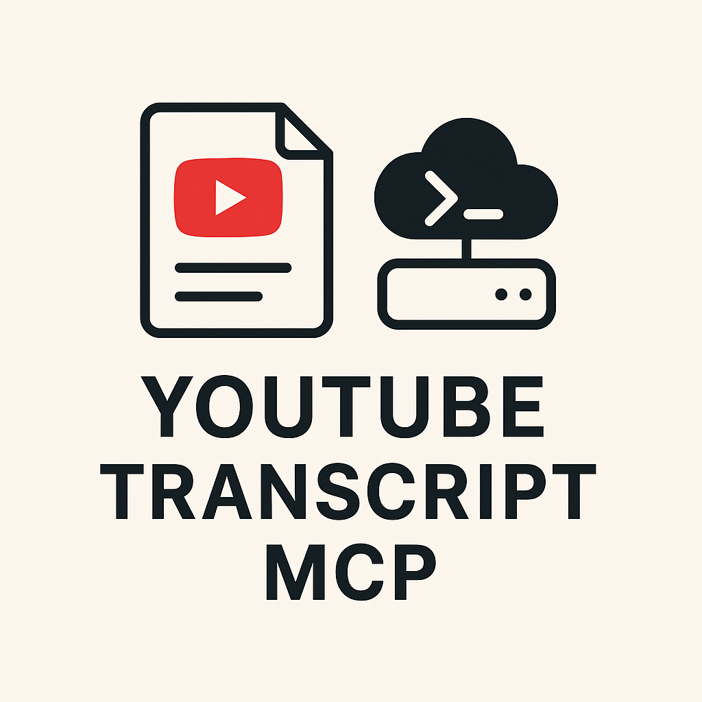

<div align="center">
  

  # YouTube Transcript Remote MCP Server

  YouTube 動画の字幕を取得する Remote MCP サーバー。Cloudflare Workers 上で動きます。
</div>

[ergut/youtube-transcript-mcp](https://github.com/ergut/youtube-transcript-mcp) をフォーク元とした、自前ホスティング用の構成です。

## 本家からの変更点

- **Streamable HTTP 対応** — `/mcp` を MCP 仕様（`2025-06-18` / `2025-03-26` / `2024-11-05`）に準拠させ、Claude アプリのカスタムコネクタから直接繋がるようにしました。通知（`notifications/initialized` など）には `202` を返し、本文を返しません。仕様上、通知にレスポンスを返してはいけないためです。
- **未使用依存の削除** — 元は GitHub OAuth テンプレートの流用で、`octokit` / `hono` / `agents` / `@modelcontextprotocol/sdk` など9個の依存と3ファイルが未使用のまま残っていました。実際に使うのは `youtube-transcript` と `url-parse` だけです。
- **言語自動検出の修正** — 下記参照。
- `ping` / `tools.listChanged` に対応、ツール失敗は MCP 慣例どおり `isError: true` を含む結果として返却。

### 言語自動検出のバグ修正

元の実装は、字幕が見つからないと12言語 × 3リトライ = **最大36サブリクエスト**を順に投げていました。早期打ち切りの判定 `isLanguageRelatedError()` は存在しましたが、リトライ層がエラーを `Failed to fetch transcript for ...` という文字列で包むため、その中の "transcript" に必ずマッチしてしまい、**一度も発火しない実質デッドコード**でした。

Cloudflare Workers 無料プランのサブリクエスト上限は50なので、これは上限に迫るうえ、MCP クライアント側のタイムアウトにも掛かります。

修正として、メッセージの部分一致ではなく `youtube-transcript` が投げる**エラークラス**で分類するようにしました。さらに、YouTube が「利用可能な言語一覧」をエラーに含めて返すため、総当たりをやめてその一覧を使います。

計測値（字幕取得に失敗するケース）:

| | 試行言語 | サブリクエスト | 所要時間 |
|---|---|---|---|
| 修正前 | 12 | 36 | 36.5s |
| 修正後 | 1 | 3 | 3.0s |

## デプロイ手順

Cloudflare アカウントが必要です。

```bash
git clone https://github.com/iakito-dev/youtube-transcript-mcp
cd youtube-transcript-mcp
npm install

# Cloudflare にログイン（ブラウザが開きます）
npx wrangler login

# KV namespace を作成する
npx wrangler kv namespace create TRANSCRIPT_CACHE
```

最後のコマンドが出力する id を `wrangler.toml` の `kv_namespaces.id` に貼り付けてから:

```bash
npm run deploy
```

`https://youtube-transcript-mcp.<あなたのサブドメイン>.workers.dev` が払い出されます。

### 動作確認

```bash
curl -X POST https://<あなたのURL>/mcp \
  -H 'Content-Type: application/json' \
  -d '{"jsonrpc":"2.0","id":1,"method":"tools/list"}'
```

`get_transcript` が1件返れば成功です。

## Claude アプリへの登録

設定 → コネクタ → カスタムコネクタを追加 で、以下を指定します。

```
https://<あなたのURL>/mcp
```

登録後は、チャットに YouTube の URL を貼って「この動画を要約して」と頼むだけで、Claude が `get_transcript` を呼んで字幕を取得します。

`mcp-remote` 経由（Claude Desktop の `claude_desktop_config.json`）を使う場合:

```json
{
  "mcpServers": {
    "youtube-transcript": {
      "command": "npx",
      "args": ["mcp-remote", "https://<あなたのURL>/mcp"]
    }
  }
}
```

## ツール

### `get_transcript`

| 引数 | 必須 | 説明 |
|---|---|---|
| `url` | ○ | YouTube 動画の URL（`youtube.com/watch` / `youtu.be` / `shorts` / `live` / `embed` など） |
| `language` | | 言語コード（`en`, `ja` など）。既定は `auto` で、YouTube が提供する言語から自動選択します |

トラッキングパラメータ（`?si=`、`&t=` など）は自動で除去されます。

## 制約事項

- **字幕のない動画は要約できません。** このサーバーは YouTube が持つ字幕（自動生成含む）を取得するだけで、音声の書き起こしは行いません。
- **YouTube 側のボット検出を受ける可能性があります。** `youtube-transcript` は公式 API ではなく視聴ページのスクレイピングで動作するため、データセンター IP からのアクセスがブロックされることがあります。Cloudflare Workers の IP がこれに該当する場合、字幕取得が失敗します。**この挙動は実環境にデプロイしてからでないと確認できません。**
- 取得した字幕は KV に7日間キャッシュされます。
- 認証はありません。URL を知っていれば誰でも利用できます。気になる場合は Cloudflare Access などを前段に置いてください。

## ライセンス

MIT（[ergut/youtube-transcript-mcp](https://github.com/ergut/youtube-transcript-mcp) の LICENSE を継承）
